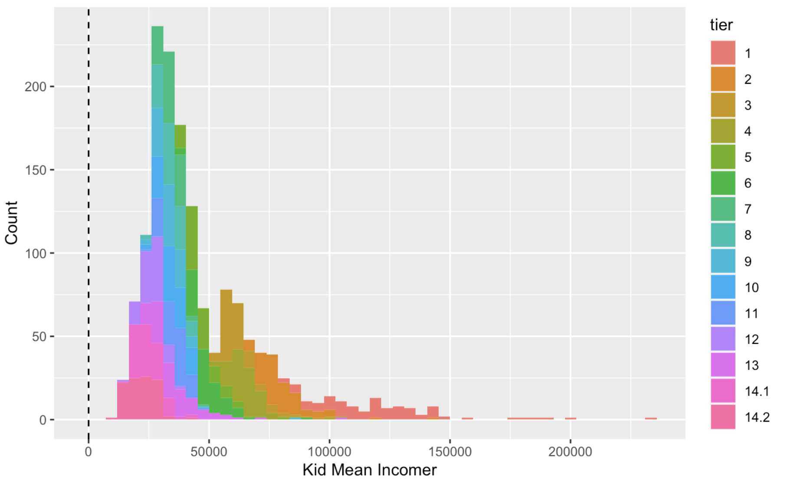
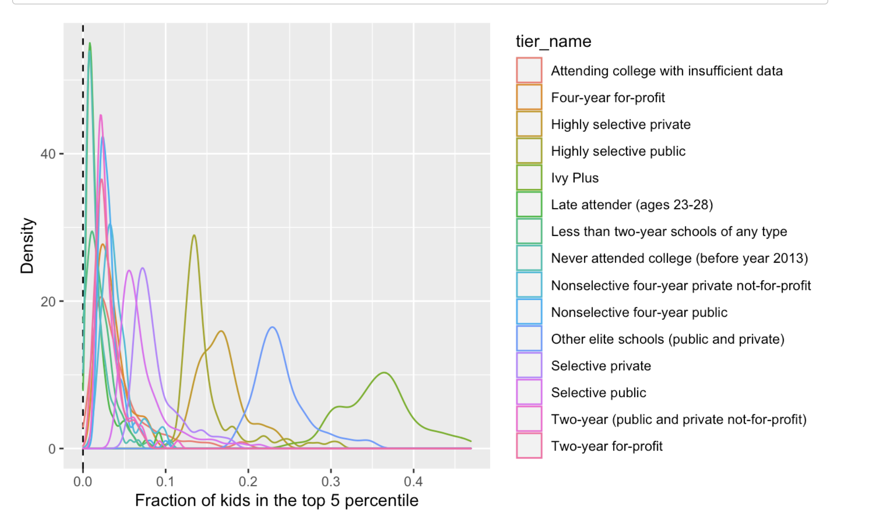
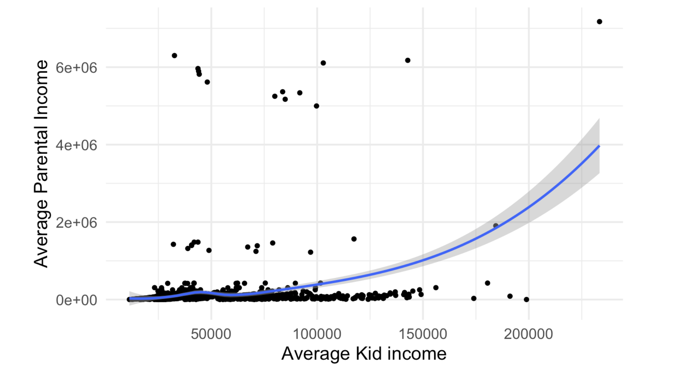
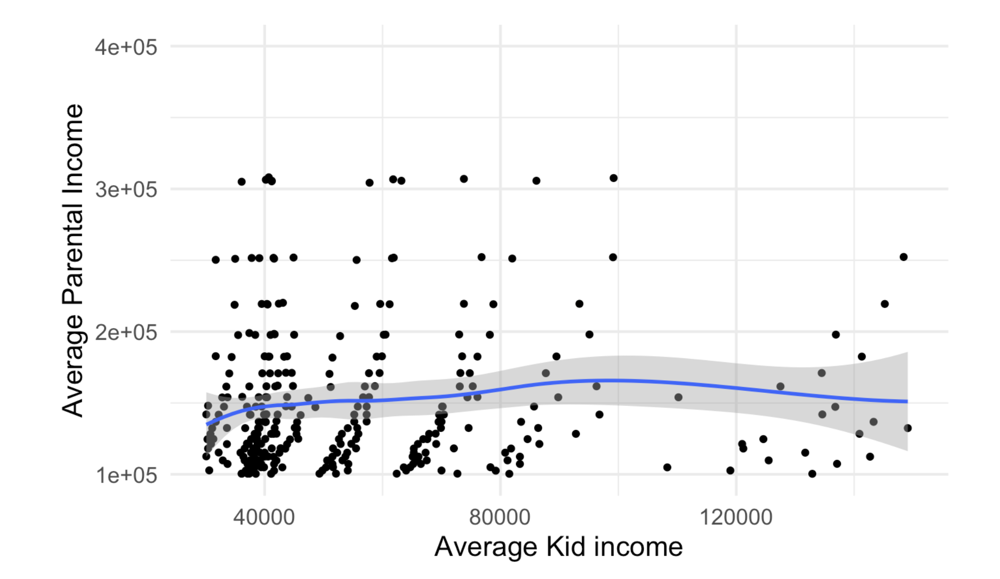
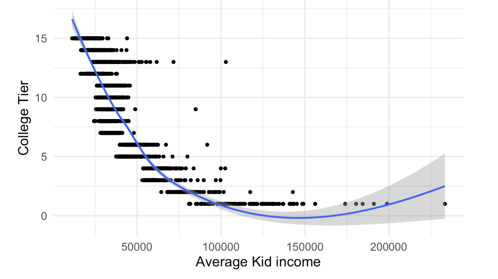
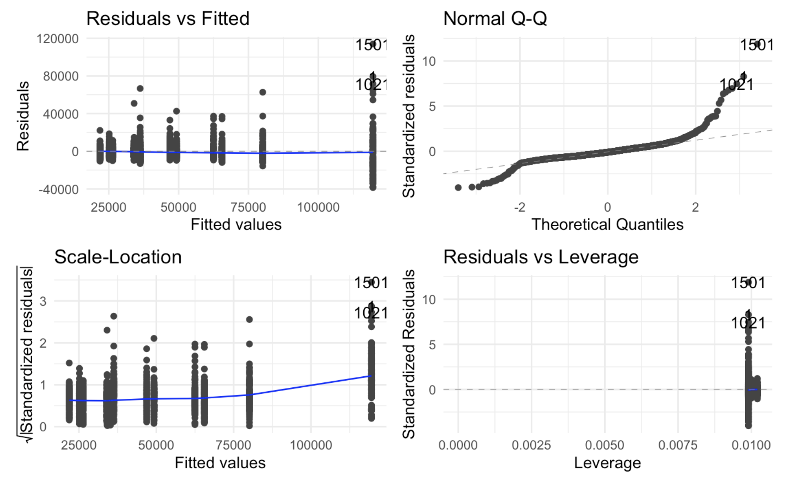
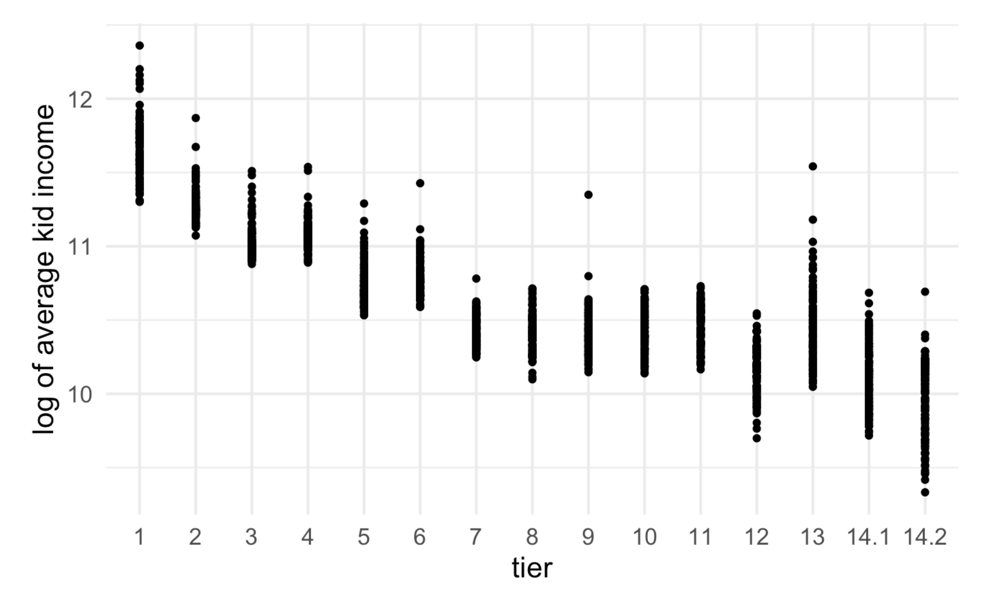
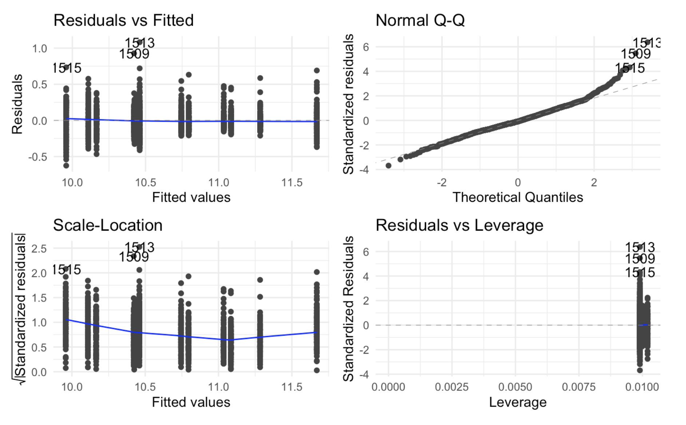
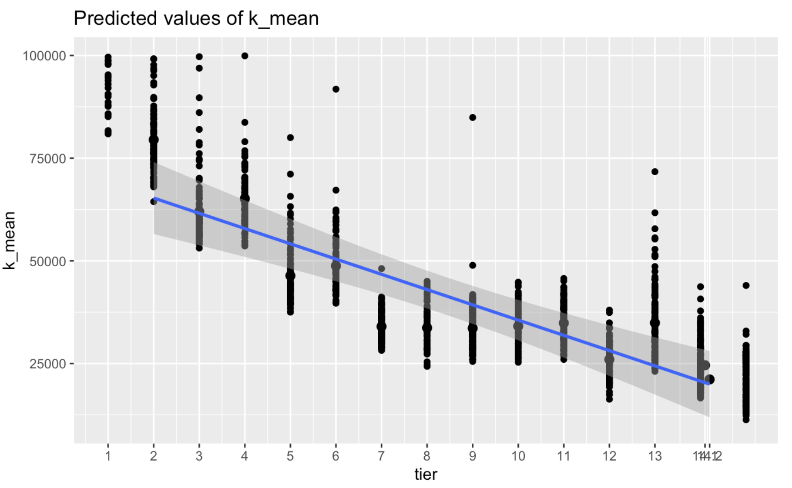

# Biostatistical-Data
# Project: Education and Income Analysis

## Introduction
In today’s world, where technological advancements and high literacy rates have transformed society, the value of formal education and its impact on socio-economic status is a topic of significant debate. This project investigates whether access to higher education correlates with higher income levels, particularly focusing on how different tiers of educational institutions and parental income affect student earnings.

## Data Preparation and Description

### 2.1 Data Description
The dataset used for this analysis is sourced from Opportunity Insights and includes cross-sectional statistics on child income by college tier and parental income percentile. The data features various educational tiers ranging from Ivy League schools to non-selective institutions and details about children’s average income, median income, parental income, and the distribution of children across these educational tiers.

**Key Variables:**
- `tier`: Education tier of the institution.
- `tier_name`: Name of the education tier.
- `par_mean`: Mean parental household income in the specified percentile and tier.
- `k_mean`: Mean earnings of children.
- `k_rank`: Rank of children's earnings.
- `k_top[PCTILE]pc`: Fraction of kids in the top percentile.
- `k_q[KIDQUINT]`: Fraction of kids in each income quintile.
- `k_nowork`: Fraction of kids not working.
- `married`: Fraction of kids married in 2014.
- `k_median`: Median child individual earnings in 2014.
- `k_median_nozero`: Median earnings excluding zeros.
- `count`: Number of kids in each parental income tier-cell.
- `tot_count`: Total number of kids in the tier.
- `density`: Fraction of kids in each parental income bracket by tier.

### 2.2 Data Preparation: R Environment
The analysis was conducted using the R environment with the following packages:
- `readr`
- `tidyr`
- `dplyr`
- `ggplot2`
- `ggfortify`
- `GGally`
- `sjPlot`
- `modEvA`

### 2.3 Data Loading and Manipulation
The dataset was loaded from a CSV file and converted to factors where necessary to facilitate analysis and visualization. Data manipulations included summarizing and grouping data to understand income distributions and educational impacts.

## Data Visualization

### 3.1 Histogram of Average Kid Income by Tier

The histogram shows the distribution of average child income across different educational tiers. Higher income averages are observed in top-tier schools, with a concentration of data between $30,000 and $100,000.

### 3.2 Density Plot of Top 5% Kids by Tier

This density plot illustrates the fraction of kids in the top 5% percentile across various tiers. The highest densities are observed in selective and highly selective schools.

## Data Representation and Modeling

### 4.1 Scatter Plot of Average Kid Income vs. Parental Income

This scatter plot examines the relationship between average parental income and average kid income. The data shows a weak correlation.

### 4.2 Zoomed-In Scatter Plot

Zooming in on the scatter plot highlights that the correlation between parental income and kid income remains weak.

### 4.3 Scatter Plot of Average Kid Income vs. College Tier

The plot indicates a potential positive correlation between educational tier and average kid income. Higher tiers tend to show higher average incomes.

### 4.4 Linear Model of Average Kid Income by Tier

A linear regression model reveals a general trend that higher educational tiers correlate with higher incomes, though the fit is not strong.

### 4.5 Residual and Diagnostic Plots

Diagnostic plots for the linear model help assess the fit and residuals, revealing issues such as non-linearity and skewed distributions.

### 4.6 Log-Transformed Linear Model

A log-transformed model was tested to better fit the data, but results were similar to the original model.

### 4.7 Summary of Log-Transformed Model

This summary details the transformed model coefficients, showing minimal changes compared to the initial linear model.

## Results and Discussion
The analysis shows that while there is a noticeable trend of higher average kid incomes associated with top-tier schools, the correlation between parental income and kid income is weak. The models indicate that education tier has a more pronounced effect on income than parental income alone.

## Conclusion
The study suggests that educational tier plays a significant role in determining average kid income, with top-tier schools generally associated with higher earnings. However, the impact of parental income on child income is less clear, highlighting the need for further research into the interplay between education, socio-economic status, and income.

## Future Work
Future analyses could incorporate more variables and different datasets to refine the understanding of how educational access and parental income influence income outcomes.

---

For more details or to access the dataset and code, please refer to the `data` and `scripts` directories.

